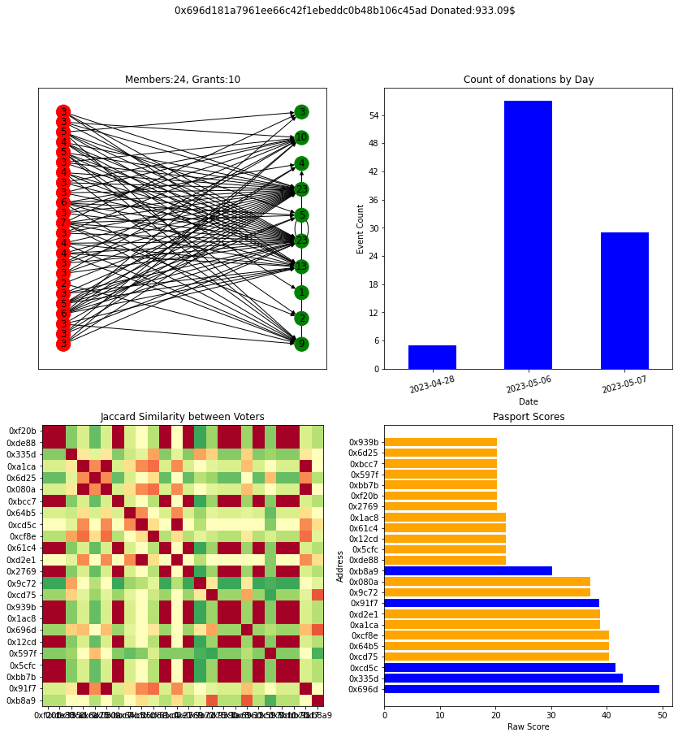

# Sybil-scope

Method of finding similarities between addresses in suspected sybil group made for ODC Regen Rangers.

See `beta_round_clusters_Hop.csv` for listing of all suspected airdrop Hop sybils (according to Hop) active in Beta gitcoin.

See attached `sus_on_chain` notebook for method of calculating and drawing similarities within sybil groups.
